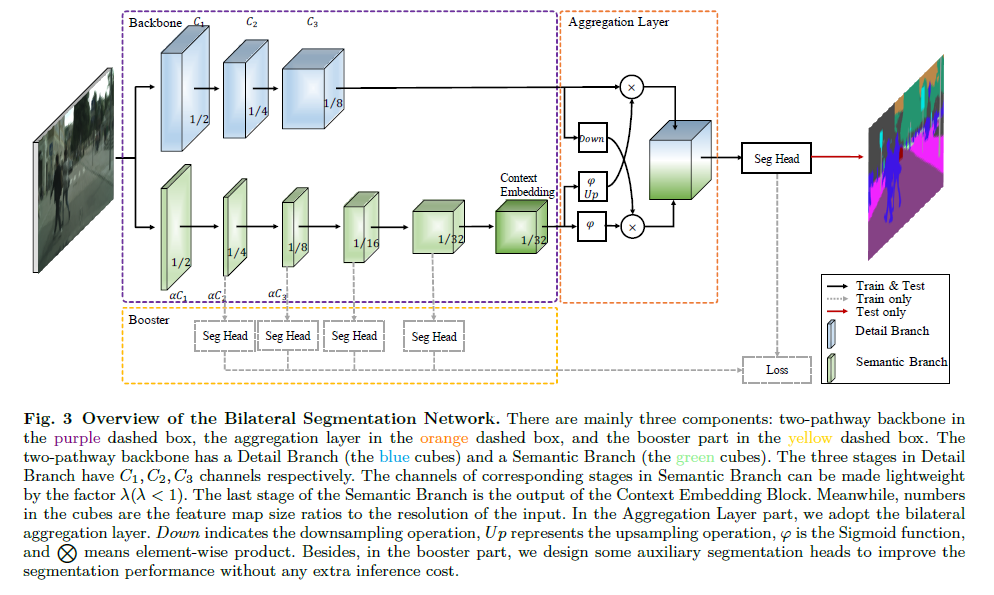
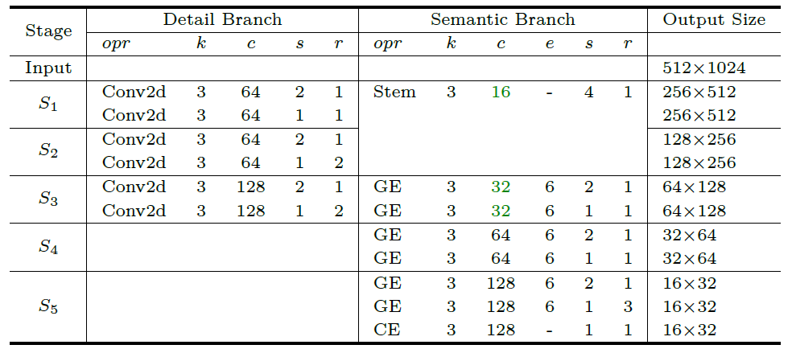

# [BiSeNet V2](https://arxiv.org/pdf/2004.02147.pdf)
BiSeNet V2: Bilateral Network with Guided Aggregation for Real-time Semantic Segmentation

This repository contain implementation of BiSeNet V2 in Tensorflow/Keras.

## Overview
<p align="center">
  </br>
</p>

### Detailed Implementation
<p align="center">
  </br>
  <span align="center"><b>Instantiation of the Detail Branch and Semantic Branch</b>. Each stage <b>S</b> contains one or more operations opr
(e.g., <b>Conv2d, Stem, GE, CE</b>). Each operation has a kernels size k, stride s and output channels c, repeated r times. The expansion
factor e is applied to expand the channel number of the operation. Here the channel ratio is <b> &#x0251; = 1/4</b>. The green colors mark
fewer channels of Semantic Branch in the corresponding stage of the Detail Branch. Notation: Conv2d means the convolutional
layer, followed by one batch normalization layer and relu activation function. Stem indicates the stem block. GE represents the
gather-and-expansion layer. CE is the context embedding block. </span> 
</p>


```
Dependies:
Tensorflow 2.0 or later
```

Licensed under [MIT License](LICENSE)
